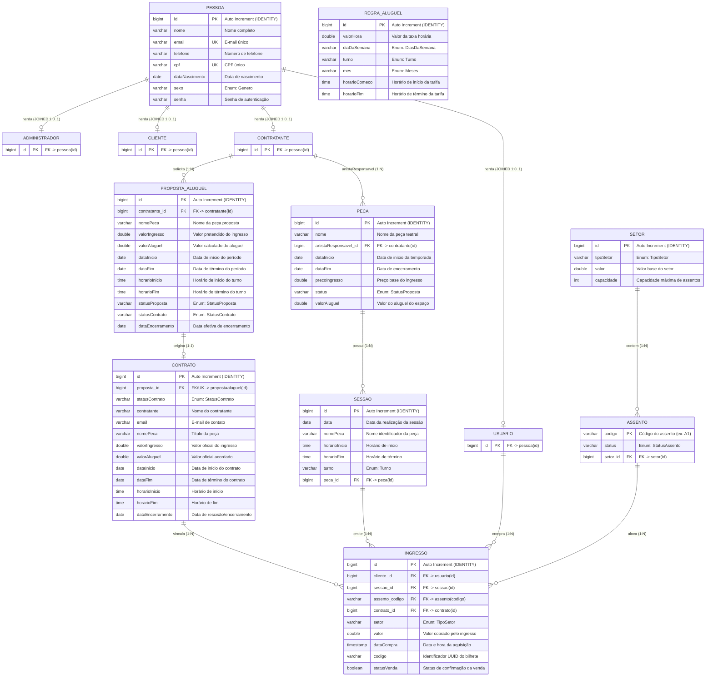

# projeto-teatro
Projeto final Banco de Dados II


# Modelo Relacional do Sistema de Teatro

## 1. Mapeamento de Herança: Estratégia `InheritanceType.JOINED`

O projeto utiliza a estratégia de herança **`InheritanceType.JOINED`** (Tabela por Subclasse com Junção) mapeada na classe abstrata `Pessoa`:

```java
@Entity
@Table(name = "pessoa")
@Inheritance(strategy = InheritanceType.JOINED)
public abstract class Pessoa { ... }
```

### Como a herança é traduzida no banco de dados relacional:
1. **Tabela Base (`pessoa`)**:
   - Armazena todos os atributos compartilhados: `id`, `nome`, `email`, `telefone`, `cpf`, `dataNascimento`, `sexo` e `senha`.
   - A coluna `id` é a chave primária (`PK`) gerada por auto-incremento (`IDENTITY`).
   - Os campos `email` e `cpf` possuem restrição de unicidade (`UNIQUE`).

2. **Tabelas de Especialização (`administrador`, `cliente`, `contratante`, `usuario`)**:
   - Cada subclasse mapeada com `@Entity` possui sua própria tabela relacional no banco.
   - A chave primária `id` de cada tabela filha **não é gerada independentemente**; ela atua simultaneamente como **Chave Primária (PK)** e **Chave Estrangeira (FK)**, referenciando diretamente a coluna `pessoa(id)`.
   - **Cardinalidade do Vínculo**: Cada registro em uma tabela filha corresponde estritamente a um registro na tabela `pessoa` (relação `1:1` ou `1:0..1` do ponto de vista da superclasse).

```
                      ┌────────────────────────┐
                      │         PESSOA         │
                      │ (PK: id, nome, cpf...) │
                      └───────────┬────────────┘
         ┌────────────────┬───────┴────────┬────────────────┐
         │ (1:0..1)       │ (1:0..1)       │ (1:0..1)       │ (1:0..1)
         ▼                ▼                ▼                ▼
┌────────────────┐┌────────────────┐┌────────────────┐┌────────────────┐
│ ADMINISTRADOR  ││    CLIENTE     ││  CONTRATANTE   ││    USUARIO     │
│ (PK,FK: id)    ││ (PK,FK: id)    ││ (PK,FK: id)    ││ (PK,FK: id)    │
└────────────────┘└────────────────┘└────────────────┘└────────────────┘
```

---

## 2. Diagrama Entidade-Relacionamento (ER) em Mermaid

O diagrama a seguir detalha a totalidade das tabelas, chaves primárias (`PK`), chaves estrangeiras (`FK`), restrições de unicidade (`UK`) e as cardinalidades exatas mapeadas nas anotações JPA.



---

## 3. Dicionário de Dados

Abaixo estão detalhadas todas as entidades do modelo de domínio, suas respectivas tabelas no banco de dados relacional, propósitos e relacionamentos centrais.

---

### 3.1. `Pessoa` (Tabela: `pessoa`)
- **Propósito**: Superclasse abstrata que consolida os dados cadastrais, civis e de autenticação comuns a todas as pessoas que interagem com o sistema (administradores, artistas/contratantes, usuários e clientes).
- **Estratégia de Persistência**: `InheritanceType.JOINED`.
- **Atributos**:
  - `id` (`BIGINT`, PK, Auto Increment): Identificador único global da pessoa.
  - `nome` (`VARCHAR(255)`): Nome completo da pessoa.
  - `email` (`VARCHAR(255)`, UNIQUE): E-mail de cadastro e login.
  - `telefone` (`VARCHAR(255)`): Número de telefone para contato.
  - `cpf` (`VARCHAR(255)`, UNIQUE): Cadastro de Pessoa Física.
  - `dataNascimento` (`DATE`): Data de nascimento.
  - `sexo` (`VARCHAR(255)`): Gênero (`FEMININO`, `MASCULINO`).
  - `senha` (`VARCHAR(255)`): Senha criptografada/armazenada para autenticação.
- **Relacionamentos**:
  - Especializada em `Administrador`, `Cliente`, `Contratante` e `Usuario` via junção de chaves (`id`).

---

### 3.2. `Administrador` (Tabela: `administrador`)
- **Propósito**: Representa os gestores internos do teatro com privilégios para aprovar propostas de aluguel, gerenciar regras de tarifa e acompanhar contratos.
- **Atributos**:
  - `id` (`BIGINT`, PK, FK -> `pessoa.id`): Chave primária herdada que referencia a pessoa correspondente.
- **Relacionamentos**:
  - Subclasse direta de `Pessoa`.

---

### 3.3. `Cliente` (Tabela: `cliente`)
- **Propósito**: Representa a entidade de cliente cadastrado no teatro para histórico e serviços de atendimento.
- **Atributos**:
  - `id` (`BIGINT`, PK, FK -> `pessoa.id`): Chave primária herdada que referencia a pessoa correspondente.
- **Relacionamentos**:
  - Subclasse direta de `Pessoa`.

---

### 3.4. `Contratante` (Tabela: `contratante`)
- **Propósito**: Representa produtores, companhias teatrais ou artistas responsáveis pela submissão de propostas de aluguel do espaço cênico e pela produção das peças em cartaz.
- **Atributos**:
  - `id` (`BIGINT`, PK, FK -> `pessoa.id`): Chave primária herdada que referencia a pessoa correspondente.
- **Relacionamentos**:
  - `1 : N` com `Peca`: O contratante atua como `artistaResponsavel` por uma ou mais peças teatrais.
  - `1 : N` com `PropostaAluguel`: O contratante submete uma ou várias propostas de aluguel para análise da administração.

---

### 3.5. `Usuario` (Tabela: `usuario`)
- **Propósito**: Representa o usuário final e comprador de bilhetes no sistema de bilheteria online.
- **Atributos**:
  - `id` (`BIGINT`, PK, FK -> `pessoa.id`): Chave primária herdada que referencia a pessoa correspondente.
- **Relacionamentos**:
  - `1 : N` com `Ingresso`: Um usuário adquire um ou múltiplos ingressos para diferentes sessões e espetáculos.

---

### 3.6. `Setor` (Tabela: `setor`)
- **Propósito**: Segmentação física e tarifária do teatro (ex.: Platéia, Camarote, Balcão), definindo o valor de base e o limite de capacidade física.
- **Atributos**:
  - `id` (`BIGINT`, PK, Auto Increment): Identificador único do setor.
  - `tipoSetor` (`VARCHAR(255)`): Enumeração com o tipo de área (`PLATEIA`, `CAMAROTE`, `BALCAO`).
  - `valor` (`DOUBLE`): Valor base de precificação dos assentos alocados neste setor.
  - `capacidade` (`INT`): Quantidade total de assentos que o setor comporta.
- **Relacionamentos**:
  - `1 : N` com `Assento`: Um setor contém múltiplos assentos associados (`mappedBy = "setor"`, com remoção e persistência em cascata `ALL`).

---

### 3.7. `Assento` (Tabela: `assento`)
- **Propósito**: Local físico individualizado dentro do teatro disponível para reserva e ocupação por espectadores.
- **Atributos**:
  - `codigo` (`VARCHAR(255)`, PK): Identificador natural do assento (ex.: "A1", "B12").
  - `status` (`VARCHAR(255)`): Situação operacional do assento (`DISPONIVEL`, `OCUPADO`, `RESERVADO`, `MANUTENCAO`).
  - `setor_id` (`BIGINT`, FK -> `setor.id`): Chave estrangeira que vincula o assento ao seu respectivo setor.
- **Relacionamentos**:
  - `N : 1` com `Setor`: Cada assento pertence estritamente a um setor físico do teatro.
  - `1 : N` com `Ingresso`: Um assento físico pode ser emitido em múltiplos ingressos ao longo do tempo (em sessões distintas).

---

### 3.8. `Peca` (Tabela: `peca`)
- **Propósito**: Registra a obra teatral, espetáculo ou temporada artística em exibição no teatro, seus valores de bilheteria e período de apresentação.
- **Atributos**:
  - `id` (`BIGINT`, PK, Auto Increment): Identificador único da peça.
  - `nome` (`VARCHAR(255)`): Título oficial do espetáculo.
  - `artistaResponsavel_id` (`BIGINT`, FK -> `contratante.id`): Chave estrangeira apontando para o produtor/contratante da obra.
  - `dataInicio` (`DATE`): Data de abertura da temporada.
  - `dataFim` (`DATE`): Data prevista para término da temporada.
  - `precoIngresso` (`DOUBLE`): Preço unitário base estabelecido para o ingresso do espetáculo.
  - `status` (`VARCHAR(255)`): Estado do ciclo de vida da peça (`EM_CONTRATACAO`, `CONTRATADO`, `ALTERADO`, `ENCERRADO`).
  - `valorAluguel` (`DOUBLE`): Custo acordado para a locação do teatro durante o período.
- **Relacionamentos**:
  - `N : 1` com `Contratante`: Cada peça pertence ao portfólio de um artista/produtor responsável.
  - `1 : N` com `Sessao`: Uma peça teatral é composta por diversas sessões e apresentações agendadas (`mappedBy = "peca"`, cascade `ALL`).

---

### 3.9. `Sessao` (Tabela: `sessao`)
- **Propósito**: Representa uma apresentação específica da peça teatral em um dia, turno e intervalo de horário definidos.
- **Atributos**:
  - `id` (`BIGINT`, PK, Auto Increment): Identificador único da sessão.
  - `data` (`DATE`): Data de realização do evento.
  - `nomePeca` (`VARCHAR(255)`): Descrição textual auxiliar do nome da peça.
  - `horarioInicio` (`TIME`): Horário de abertura/início da apresentação.
  - `horarioFim` (`TIME`): Horário estimado de encerramento da apresentação.
  - `turno` (`VARCHAR(255)`): Período do dia (`MANHA`, `TARDE`, `NOITE`).
  - `peca_id` (`BIGINT`, FK -> `peca.id`): Chave estrangeira que vincula a sessão à sua peça de origem.
- **Relacionamentos**:
  - `N : 1` com `Peca`: Toda sessão está obrigatoriamente vinculada a uma peça teatral.
  - `1 : N` com `Ingresso`: Cada sessão emite e comercializa seus próprios ingressos (`mappedBy = "sessao"`, cascade `ALL`).

---

### 3.10. `PropostaAluguel` (Tabela: `propostaaluguel`)
- **Propósito**: Documento preliminar de solicitação enviado pelo contratante para reservar o espaço físico do teatro em determinado período e turnos, passando por triagem de viabilidade e precificação.
- **Atributos**:
  - `id` (`BIGINT`, PK, Auto Increment): Identificador único da proposta.
  - `contratante_id` (`BIGINT`, FK -> `contratante.id`): Produtor solicitante (com persistência/mesclagem em cascata `PERSIST`, `MERGE`).
  - `nomePeca` (`VARCHAR(255)`): Título provisório ou definitivo do espetáculo proposto.
  - `valorIngresso` (`DOUBLE`): Estimativa do preço pretendido por ingresso.
  - `valorAluguel` (`DOUBLE`): Valor financeiro total calculado para a locação.
  - `dataInicio` (`DATE`): Primeiro dia solicitado para ocupação do teatro.
  - `dataFim` (`DATE`): Último dia solicitado para ocupação do teatro.
  - `horarioInicio` (`TIME`): Início da faixa de horário de uso das instalações.
  - `horarioFim` (`TIME`): Término da faixa de horário de uso das instalações.
  - `statusProposta` (`VARCHAR(255)`): Estado da proposta (`EM_CONTRATACAO`, `CONTRATADO`, `ALTERADO`, `ENCERRADO`).
  - `statusContrato` (`VARCHAR(255)`): Situação de aprovação contratual (`ATIVO`, `PENDENTE`, `INATIVO`).
  - `dataEncerramento` (`DATE`): Data em que a proposta foi cancelada, finalizada ou concluída.
- **Relacionamentos**:
  - `N : 1` com `Contratante`: Diversas propostas podem ser formalizadas pelo mesmo contratante.
  - `1 : 1` com `Contrato`: Uma proposta aprovada origina exatamente um contrato oficializado de locação.

---

### 3.11. `Contrato` (Tabela: `contrato`)
- **Propósito**: Instrumento jurídico e formal que consolida a aprovação da proposta de aluguel entre o teatro e o contratante, validando datas, valores e autorizando a venda de ingressos.
- **Atributos**:
  - `id` (`BIGINT`, PK, Auto Increment): Identificador único do contrato.
  - `proposta_id` (`BIGINT`, FK, UNIQUE -> `propostaaluguel.id`): Chave estrangeira unívoca associada à proposta que lhe deu origem (`cascade = CascadeType.MERGE`).
  - `statusContrato` (`VARCHAR(255)`): Estado operacional do contrato (`ATIVO`, `PENDENTE`, `INATIVO`).
  - `contratante` (`VARCHAR(255)`): Nome do contratante espelhado no contrato.
  - `email` (`VARCHAR(255)`): E-mail do contratante no momento da celebração.
  - `nomePeca` (`VARCHAR(255)`): Nome da peça homologada no contrato.
  - `valorIngresso` (`DOUBLE`): Preço fixado para venda dos ingressos deste contrato.
  - `valorAluguel` (`DOUBLE`): Valor total fechado para a locação do teatro.
  - `dataInicio` (`DATE`): Vigência inicial da locação.
  - `dataFim` (`DATE`): Vigência final da locação.
  - `horarioInicio` (`TIME`): Horário inicial diário autorizado.
  - `horarioFim` (`TIME`): Horário final diário autorizado.
  - `dataEncerramento` (`DATE`): Data de liquidação ou rescisão do contrato.
- **Relacionamentos**:
  - `1 : 1` com `PropostaAluguel`: Vinculado exclusivamente a uma proposta aprovada.
  - `1 : N` com `Ingresso`: Ingressos vendidos ficam subordinados às regras financeiras e jurídicas deste contrato.

---

### 3.12. `Ingresso` (Tabela: `ingresso`)
- **Propósito**: Bilhete de acesso emitido para um usuário/espectador assistir a uma sessão específica, em um assento determinado e sob as regras de um contrato vigente.
- **Atributos**:
  - `id` (`BIGINT`, PK, Auto Increment): Identificador numérico único do bilhete no banco de dados.
  - `cliente_id` (`BIGINT`, FK -> `usuario.id`): Chave estrangeira do comprador (entidade `Usuario`).
  - `sessao_id` (`BIGINT`, FK -> `sessao.id`): Chave estrangeira que determina a sessão do espetáculo.
  - `assento_codigo` (`VARCHAR(255)`, FK -> `assento.codigo`): Chave estrangeira que referencia a poltrona alocada.
  - `contrato_id` (`BIGINT`, FK -> `contrato.id`): Chave estrangeira que referencia o contrato da produção correspondente.
  - `setor` (`VARCHAR(255)`): Cópia informativa do tipo de setor (`PLATEIA`, `CAMAROTE`, `BALCAO`).
  - `valor` (`DOUBLE`): Preço final pago na compra do bilhete.
  - `dataCompra` (`TIMESTAMP`): Registro cronológico de quando a transação foi efetivada.
  - `codigo` (`VARCHAR(255)`): Código alfanumérico identificador gerado via `UUID` para validação na portaria.
  - `statusVenda` (`BOOLEAN`): Indicador de aprovação e liquidação da venda do ingresso.
- **Relacionamentos**:
  - `N : 1` com `Usuario` (`cliente`): Comprador do bilhete.
  - `N : 1` com `Sessao`: Sessão específica agendada.
  - `N : 1` com `Assento`: Cadeira/poltrona física selecionada.
  - `N : 1` com `Contrato`: Contrato artístico vigente da produção.

---

### 3.13. `RegraAluguel` (Tabela: `regraaluguel`)
- **Propósito**: Tabela paramétrica de tarifação e política comercial do teatro, usada para calcular dinamicamente o custo de locação com base em sazonalidade, turno e dia da semana.
- **Atributos**:
  - `id` (`BIGINT`, PK, Auto Increment): Identificador único da regra de aluguel.
  - `valorHora` (`DOUBLE`): Custo tarifário por hora de uso do teatro.
  - `diaDaSemana` (`VARCHAR(255)`): Dia aplicável (`SEGUNDA`, `TERCA`, `QUARTA`, `QUINTA`, `SEXTA`, `SABADO`, `DOMINGO`).
  - `turno` (`VARCHAR(255)`): Turno de aplicação da tarifa (`MANHA`, `TARDE`, `NOITE`).
  - `mes` (`VARCHAR(255)`): Mês de referência (`JANEIRO` a `DEZEMBRO`).
  - `horarioComeco` (`TIME`): Limite inferior do horário de vigência da regra.
  - `horarioFim` (`TIME`): Limite superior do horário de vigência da regra.
- **Relacionamentos**:
  - Tabela independente de precificação; consultada pelos serviços do sistema durante a elaboração de propostas sem dependência de integridade referencial física direta (sem FKs).

---

## 4. Matriz de Integridade Referencial e Chaves Estrangeiras

| Tabela Origem | Coluna FK | Tabela Destino | Coluna PK Destino | Cardinalidade | Anotação JPA Correspondente |
| :--- | :--- | :--- | :--- | :---: | :--- |
| `administrador` | `id` | `pessoa` | `id` | `1 : 0..1` | `@Inheritance(strategy = JOINED)` |
| `cliente` | `id` | `pessoa` | `id` | `1 : 0..1` | `@Inheritance(strategy = JOINED)` |
| `contratante` | `id` | `pessoa` | `id` | `1 : 0..1` | `@Inheritance(strategy = JOINED)` |
| `usuario` | `id` | `pessoa` | `id` | `1 : 0..1` | `@Inheritance(strategy = JOINED)` |
| `assento` | `setor_id` | `setor` | `id` | `N : 1` | `@ManyToOne private Setor setor;` |
| `peca` | `artistaResponsavel_id` | `contratante` | `id` | `N : 1` | `@ManyToOne private Contratante artistaResponsavel;` |
| `sessao` | `peca_id` | `peca` | `id` | `N : 1` | `@ManyToOne private Peca peca;` |
| `propostaaluguel` | `contratante_id` | `contratante` | `id` | `N : 1` | `@ManyToOne(cascade = {...}) private Contratante contratante;` |
| `contrato` | `proposta_id` | `propostaaluguel` | `id` | `1 : 1` | `@OneToOne(cascade = MERGE) private PropostaAluguel proposta;` |
| `ingresso` | `cliente_id` | `usuario` | `id` | `N : 1` | `@ManyToOne private Usuario cliente;` |
| `ingresso` | `sessao_id` | `sessao` | `id` | `N : 1` | `@ManyToOne private Sessao sessao;` |
| `ingresso` | `assento_codigo` | `assento` | `codigo` | `N : 1` | `@ManyToOne private Assento assento;` |
| `ingresso` | `contrato_id` | `contrato` | `id` | `N : 1` | `@ManyToOne private Contrato contrato;` |

---

## 5. Tipos Enumerados do Sistema

| Enumeração | Valores Possíveis | Entidades Usuárias |
| :--- | :--- | :--- |
| `Genero` | `FEMININO`, `MASCULINO` | `Pessoa` |
| `StatusAssento` | `DISPONIVEL`, `OCUPADO`, `RESERVADO`, `MANUTENCAO` | `Assento` |
| `TipoSetor` | `PLATEIA`, `CAMAROTE`, `BALCAO` | `Setor`, `Ingresso` |
| `Turno` | `MANHA`, `TARDE`, `NOITE` | `Sessao`, `RegraAluguel` |
| `StatusProposta` | `EM_CONTRATACAO`, `CONTRATADO`, `ALTERADO`, `ENCERRADO` | `PropostaAluguel`, `Peca` |
| `StatusContrato` | `ATIVO`, `PENDENTE`, `INATIVO` | `Contrato`, `PropostaAluguel` |
| `DiasDaSemana` | `SEGUNDA`, `TERCA`, `QUARTA`, `QUINTA`, `SEXTA`, `SABADO`, `DOMINGO` | `RegraAluguel` |
| `Meses` | `JANEIRO`, `FEVEREIRO`, `MARCO`, `ABRIL`, `MAIO`, `JUNHO`, `JULHO`, `AGOSTO`, `SETEMBRO`, `OUTUBRO`, `NOVEMBRO`, `DEZEMBRO` | `RegraAluguel` |

